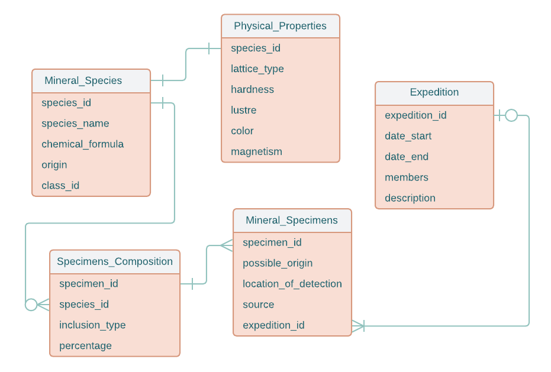

Web-application CMC MSU
=======================

# Коллекция минералов

Схема базы данных
-----------------

Описание страниц
-----------------------

На каждой странице верхнее меню с кнопками:

- "Главная" -> список образцов
- "Минералы" -> список минералов
- "Образцы" -> список образцов
- "Экспедиции" -> список экспедиций

#### 1. Главная страница - Образцы

- поля-атрибуты:
  - номер образца
  - возможное происхождение
  - источник
- сортировка по номеру
- фильтрация по номеру, возможному происхождению, источнику
- кнопка "Добавить образец" -> Страница для изменения (добавления) образца

#### 2. Информация об образце

- подробная информация об образце:
  - возможное происхождение
  - источник
  - место обнаружения
  - входящие минералы, тип включения и % часть образца
- кнопка "Экспедиция" -> Страница с информацией об экспедиции
- кнопка "Редактирование" -> Страница для изменения образца
- кнопка "Добавить вхождение" - добавить входящий минерал (тип включения, примерная % часть образца)
- кнопка "Удалить вхождение" - удалить входящий минерал (тип включения, примерная % часть образца)

#### 3. Страница для изменения образца

- редактируемые поля:
  - возможное происхождение
  - источник
  - место обнаружения (координаты, описание)
  - экспедиция (дата начала, конца, участники)

#### 4. Минералы - список минералов

- поля-атрибуты:
  - название
  - происхождение
  - агрегатное состояние
- сортировка и фильтрация по названию
- кнопка "Добавить минерал" -> Страница для изменения (добавления) минерала

#### 5. Информация о минерале

- подробная информация о минерале:
  - название
  - химическая формула
  - происхождение
  - агрегатное состояние
  - тип кристаллической решётки, твёрдость, хрупкость
  - блеск, цвет, магнитные свойства
- список образцов в коллекции
- кнопка "Редактирование" -> Страница для изменения (добавления) минерала

#### 6. Страница для изменения (добавления) минерала

- редактируемые поля:
  - название
  - химическая формула
  - происхождение
  - агрегатное состояние
  - тип кристаллической решётки, твёрдость, хрупкость
  - блеск, цвет, магнитные свойства
- кнопка "Сохранить"

#### 7. Экспедиции - список экспедиций

- поля-атрибуты:
  - даты начала и конца
  - участники
- сортировка по дате начала, конца, длительности
- фильтрация по датам, участникам
- кнопка "Добавить экспедицию" -> Страница для изменения (добавления) экспедиции

#### 8. Информация об экспедиции

- подробная информация об экспедиции:
  - даты начала и конца
  - участники
  - список найденных образцов
- кнопка "Редактирование" -> Страница для изменения (добавления) экспедиции

#### 9. Страница для изменения (добавления) экспедиции

- редактируемые поля:
  - даты начала и конца
  - участники
  - описание
- кнопка "Добавить образец"
- кнопка "Сохранить"

Некоторые сценарии использования
----------------------

- Найти все образцы по минералу (номеру образца, источнику, возможному происхождению)
  - Перейти на главную страницу
  - Ввести название минерала (номер образца, источник, возможное происхождение)
  - Нажать кнопку "Поиск"

- Найти все образцы по экспедиции
  - Перейти на главную страницу
  - Применить фильтр по датам
  - Перейти на страницу с информацией об экспедиции
  - Нажать кнопку "Образцы"

- Найти все минералы, входящие в образец
  - Перейти на страницу со списком образцов
  - Применение фильтра по номеру образца
  - Перейти на страницу с информацией об образце

- Редактирование информации об образце
  - Перейти на страницу со списком образцов
  - Применение фильтра по номеру образца
  - Перейти на страницу с информацией об образце
  - Нажать кнопку "Редактировать"
  - Изменить информацию
  - Нажать кнопку "Сохранить"

- Добавление нового образца
  - Перейти на страницу со списком образцов
  - Нажать кнопку "Добавить образец"
  - Ввести информацию
  - Нажать кнопку "Сохранить"
  - Добавить входящие минералы
    - ввести название минерала, тип включения и % часть образца -> нажать кнопку "Добавить вхождение"
    - при необходимости можно удалить вхождение - нажать кнопку "Удалить вхождение"

- Добавление нового минерала
  - Перейти на страницу со списком минералов
  - Нажать кнопку "Добавить минерал"
  - Ввести информацию
  - Нажать кнопку "Сохранить"

- Редактирование информации о минерале
  - Перейти на страницу со списком минералов
  - Применение фильтра по названию минерала
  - Перейти на страницу с информацией о минерале
  - Нажать кнопку "Редактировать"
  - Изменить информацию
  - Нажать кнопку "Сохранить"

- Добавление новой экспедиции
  - Перейти на страницу со списком экспедиций
  - Нажать кнопку "Добавить экспедицию"
  - Ввести информацию
  - Нажать кнопку "Сохранить"

- Редактирование информации об экспедиции
  - Перейти на страницу со списком экспедиций
  - Применение фильтра по датам
  - Перейти на страницу с информацией об экспедиции
  - Нажать кнопку "Редактировать"
  - Изменить информацию
  - Нажать кнопку "Сохранить"
