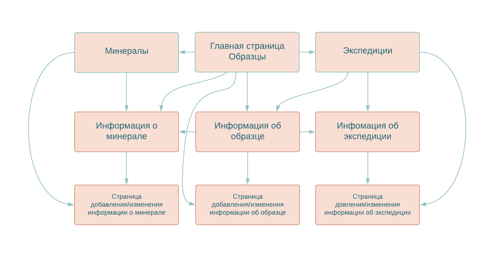

Web-application CMC MSU
=======================

# Коллекция минералов

Схема базы данных
-----------------

Описание страниц
-----------------------

На каждой странице верхнее меню с кнопками:

- "Главная" -> главная страница
- "Минералы" -> список минералов
- "Образцы" -> список образцов
- "Экспедиции" -> список экспедиций

#### 1. Главная страница

- Поиск образцов по
  - минералу
  - источнику
  - происхождению
  - экспедиции

- Кнопки "Поиск" и "Сброс"

#### 2. Минералы

- Список минералов (сортировка и фильтрация по названию, классу, происхождению, состоянию)
- Кнопка "Добавить минерал" -> Страница для изменения (добавления) минерала

#### 3. Информация о минерале

- подробная информация о минерале
- список образцов в коллекции

- кнопка "Редактирование" -> Страница для изменения (добавления) минерала

#### 4. Страница для изменения (добавления) минерала

- редактируемые поля
  - название
  - химическая формула
  - происхождение
  - тип, класс, подкласс
  - агрегатное состояние
  - тип кристаллической решётки, твёрдость, хрупкость
  - блеск, цвет, магнитные свойства 
- Кнопка "Сохранить"

#### 5. Список образцов
  (номер образца, возможное происхождение, источник)
  - сортировка по номеру
  - фильтрация по происхождению, источнику
  - кнопка "Добавить образец" -> Страница для изменения (добавления) образца

#### 6. Информация об образце
  - возможное происхождение
  - источники
  - экспедиция
  - входящие минералы, тип включения и % часть образца
  - кнопка "Редактирование" -> Страница для изменения (добавления) образца

#### 7. Страница для изменения (добавления) образца

  - редактируемые поля:
    - возможное происхождение
    - место обнаружения (координаты, описание)
    - источник
    - экспедиция
  - "Добавить вхождение" - добавить входящий минерал (тип включения, примерная % часть образца)
  - "Удалить вхождение" - удалить входящий минерал (тип включения, примерная % часть образца)

#### 8. Экспедиции

  - сортировка по дате начала, конца, длительности
  - фильтрация по датам, участникам
  - кнопка "Добавить экспедицию" -> Страница для изменения (добавления) экспедиции

#### 9. Информация об экспедиции

- даты начала и конца
- участники
- список найденных образцов

- кнопка "Редактирование" -> Страница для изменения (добавления) экспедиции

#### 10. Страница для изменения (добавления) 
экспедиции

- редактируемые поля:
  - даты начала и конца
  - участники
  - описание
- Кнопка "Добавить образец" 
- Кнопка "Сохранить"

Некоторые сценарии использования
----------------------
- Найти все образцы по минералу (источнику, экспедиции, агрегатному состоянию, происхождению)
  - Перейти на главную страницу
  - Ввести название минерала (источник, агрегатное состояние, происхождение)
  - Нажать кнопку "Поиск"

- Найти все минералы, входящие в образец
  - Перейти на страницу со списком образцов
  - Применение фильтра по номеру образца
  - Перейти на страницу с информацией об образце

- Редактирование информации об образце
  - Перейти на страницу со списком образцов
  - Применение фильтра по номеру образца
  - Перейти на страницу с информацией об образце
  - Нажать кнопку "Редактировать"
  - Изменить информацию
  - Нажать кнопку "Сохранить"

- Добавление нового образца
  - Перейти на страницу со списком образцов
  - Нажать кнопку "Добавить образец"
  - Ввести информацию
  - Добавить входящие минералы 
    - ввести название минерала, тип включения и % часть образца -> нажать кнопку "Добавить вхождение"
    - при необходимости можно удалить вхождение - нажать кнопку "Удалить вхождение"
  - Нажать кнопку "Сохранить"

- Добавление нового минерала
  - Перейти на страницу со списком минералов
  - Нажать кнопку "Добавить минерал"
  - Ввести информацию
  - Нажать кнопку "Сохранить"

- Редактирование информации о минерале
  - Перейти на страницу со списком минералов
  - Применение фильтра по названию минерала
  - Перейти на страницу с информацией о минерале
  - Нажать кнопку "Редактировать"
  - Изменить информацию
  - Нажать кнопку "Сохранить"

- Добавление новой экспедиции
  - Перейти на страницу со списком экспедиций
  - Нажать кнопку "Добавить экспедицию"
  - Ввести информацию
  - Добавить образцы нажатием на кнопку "Добавить образец"
  - Нажать кнопку "Сохранить"

- Редактирование информации об экспедиции
  - Перейти на страницу со списком экспедиций
  - Применение фильтра по датам и участникам
  - Перейти на страницу с информацией об экспедиции
  - Нажать кнопку "Редактировать"
  - Изменить информацию
  - Нажать кнопку "Сохранить"